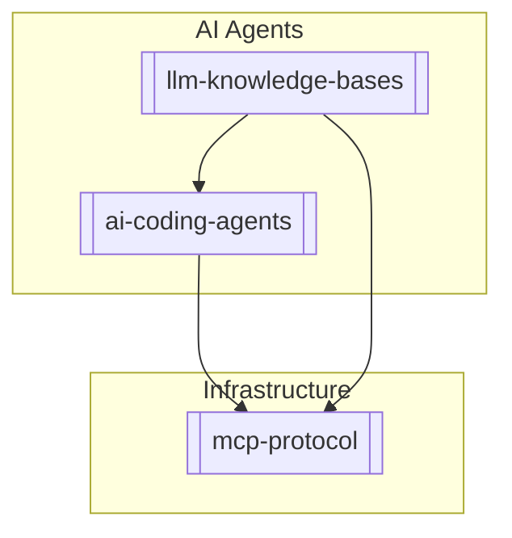

# Knowledge Graph Visualization
# Wiki -> Mermaid Graph Generator

Scan wiki/ for all [[wikilinks]] and generate a Mermaid JS graph visualization.

## Pre-condition
Have at least 5 concept pages created.

## Trigger
"graph the wiki" or "/graph"

## Process

### 1. Scan for relationships
Read EVERY markdown file in wiki/sources/ and wiki/concepts/.
Find every occurrence of `[[some-slug]]`.
Record: `Source File -> Linked File`.

### 2. Generate Markdown with Inline Mermaid
Create file: `outputs/dashboard/wiki-graph.md`.

Use Obsidian inline Mermaid code blocks (NOT standalone .mmd files). Obsidian renders ` ```mermaid ` blocks natively.

Structure:
```markdown
# Wiki Knowledge Graph

> Generated: 2026-04-07
> Nodes: N | Edges: M | Clusters: K



### 3. Identify Clusters
Wrap related nodes in Mermaid `subgraph` blocks. Group by tag if possible.

### 4. Report
"Generated 3 clusters. 9 nodes. Output saved to outputs/dashboard/wiki-graph.md."
"Open in Obsidian to interact with the Knowledge Graph — click nodes to zoom, drag to rearrange."
